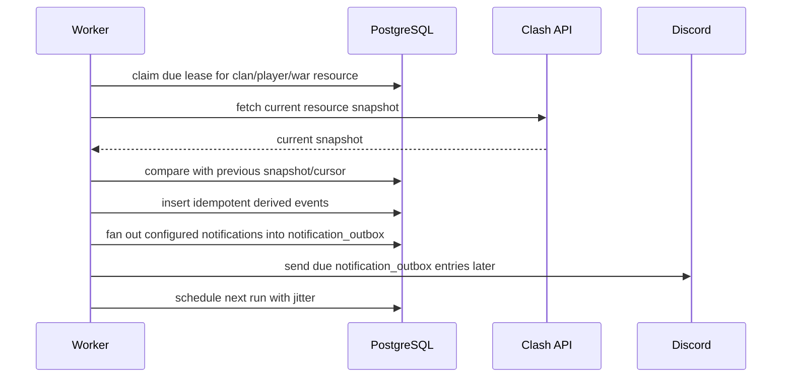

# Poller

The worker replaces heavy queue/cache infrastructure with PostgreSQL-backed scheduling.

## Verified reference behavior

The reference `/debug` command reads a Redis `loop_timings` hash and displays exactly three loop timing buckets:

- `clanLoop`
- `warLoop`
- `playerLoop`

The debug output labels them as:

```txt
CLANS | WARS | PLAYERS
```

So ClashMate should model polling around three main poller families rather than one separate poller per activity/event type.

The reference bot repository does not include the third-party poller implementation, so interval and jitter details are not directly visible there. Public docs confirm polling is snapshot-based and not real-time. Jitter should be treated as a required ClashMate design goal to avoid fixed-interval bursts.

## Goals

- Idempotent event detection
- Restart-safe jobs
- PostgreSQL-backed leases
- Jittered scheduling, not fixed-interval bursts
- No Redis
- No ClickHouse
- No Elasticsearch

## Poller families

### Clan poller

Resource type: `clan`

Expected to cover clan-level snapshots and derived events, including:

- clan metadata snapshots
- member joins/leaves
- role changes/promotions/demotions where observable
- donation deltas from clan member snapshots
- clan games deltas from member achievement snapshots
- capital contribution/raid data where exposed through clan/capital endpoints
- clan setup health such as public/private war log status

### Player poller

Resource type: `player`

Expected to cover player-level snapshots and derived events, including:

- player profile snapshots
- trophies/leagues
- legend activity where observable
- looted resources achievement deltas
- labels, heroes, troops, spells, equipment, and upgrade-related deltas where needed by commands
- last-seen/activity score signals derived from observable changes

Current ClashMate implementation polls player leases enrolled from `player_links` only. The worker
fetches `/players/{playerTag}` through `packages/coc` and upserts one row per linked player in
`player_latest_snapshots`. Search-only player lookups must not create player leases or durable
snapshots.

Clan member join/leave schema is prepared with `clan_member_snapshots` and
`clan_member_events`. The clan poller should compare the prior current member set for a linked clan
with the newest `memberList`, upsert present members, and insert guild-scoped derived events with
`on conflict do nothing` against `(guild_id, event_key)`. A player missing from the newest member
list but present in the latest snapshot for that clan should produce one `left` event per linked
guild; a player present after being absent from the previous poll should produce one `joined` event
per linked guild.

Future player-derived event detection should compare the prior `player_latest_snapshots.snapshot`
with the new payload and insert append-only events using deterministic idempotency keys such as
`player:<playerTag>:trophies:<season-or-day-bucket>:<value>` or
`player:<playerTag>:achievement:<achievementName>:<value>`, depending on the feature and public API
fields available.

### War poller

Resource type: `war`

Expected to cover war-level snapshots and derived events, including:

- regular wars
- friendly wars when applicable
- CWL wars
- war state transitions
- lineup changes
- attacks
- missed attacks derived after war end
- war reminders and notification fan-out inputs

Current ClashMate implementation starts with latest current-war snapshots derived from linked clans.
Enrollment uses `resource_id = current-war:<clanTag>` for each active `tracked_clans` row. The
worker fetches `/clans/{clanTag}/currentwar` through `packages/coc` and upserts one row per linked
clan in `war_latest_snapshots`. Search-only war lookups must not create these leases or snapshots.

Future war-derived event detection should compare the prior `war_latest_snapshots.snapshot` with the
new payload and insert append-only events using deterministic idempotency keys such as
`war:<clanTag>:state:<state>:<stateStartedAt-or-fetchedBucket>` and
`war:<clanTag>:attack:<attackerTag>:<defenderTag>:<order>`, depending on API fields available.

## Tracking scope

Continuous polling is limited to explicitly linked/configured resources.

Do track:

- clans linked to a guild through setup/config records,
- player accounts linked to Discord users,
- current members of linked clans when an enabled feature needs member/player snapshots,
- active regular-war, friendly-war, or CWL resources derived from linked clans.

Do not track:

- clans returned by one-off `/search`, `/clan`, `/player`, leaderboard, or autocomplete lookups unless they are explicitly linked,
- players returned by one-off command lookups unless they are linked accounts or current members of linked clans needed by an enabled feature,
- arbitrary public Clash API resources just because a user queried them once.

Search-only commands may fetch current API data for a response, but they must not create polling leases, durable snapshots, or long-lived tracking records.

## Enrollment rules

Polling enrollment is centralized in the database enrollment store and synced by the worker at startup. Command handlers and one-off Clash API lookups must not write `polling_leases` directly.

Current enrollment sources:

- `clan` leases are synced from active `tracked_clans` records only.
- `player` leases are synced from existing `player_links` records only.
- `war` leases are derived from linked clans only; the current placeholder key is `current-war:<clanTag>` until war/CWL cursors are implemented.

When a linked resource is removed, ClashMate should hard-delete the configuration row and hard-delete any stale polling leases during the next enrollment sync. Removed linked clans/channels should not remain as retained enrollment candidates. Audit logs preserve the important configuration-change history instead.

Search-only clan/player lookups may call the Clash API for the interaction response, but they must not create polling leases, snapshots, cursors, or other durable tracking rows.

## Scheduling model

Use PostgreSQL-backed leases in `polling_leases`.

Recommended resource keys:

```txt
resource_type = clan   resource_id = <linked_clan_tag>
resource_type = player resource_id = <linked_player_tag_or_member_of_linked_clan>
resource_type = war    resource_id = <war_key_or_war_tag_derived_from_linked_clan>
```

Each claimed lease should be rescheduled with jitter:

```txt
next_run = now + base_interval + random(0, jitter_seconds)
```

Lease claiming is atomic per row: a worker claims one due lease by updating a row selected with
`FOR UPDATE SKIP LOCKED`, scoped to one top-level `resource_type`. A lease is claimable only when
`run_after <= now` and it is either unlocked or its `locked_until` timestamp has expired. Claiming
sets `owner_id`, `locked_until`, and `updated_at`.

Successful completion clears `owner_id`, clears `locked_until`, sets the next jittered `run_after`,
clears `last_error`, and resets `attempts` to `0`. Attempts are reset deliberately because the
counter represents the current consecutive failure streak for backoff/diagnostics, not lifetime
processing history. Failure handling increments `attempts`, stores the latest error message, clears
lock ownership, and schedules the retry `run_after` supplied by the worker.

Recommended env configuration:

```env
POLL_CLAN_SECONDS=300
POLL_CLAN_JITTER_SECONDS=60

POLL_PLAYER_SECONDS=900
POLL_PLAYER_JITTER_SECONDS=180

POLL_WAR_SECONDS=120
POLL_WAR_JITTER_SECONDS=30
```

## Recommended pattern



## Implementation order

1. Lease claiming framework.
2. Polling snapshot tables/cursors.
3. Clan poller.
4. War poller.
5. Player poller.
6. Notification outbox/fan-out.

## Notification outbox

Notification delivery should be restart-safe and idempotent through PostgreSQL. The first source is
`clan_member_events` for member joins/leaves. Fan-out workers should match each event against
`clan_member_notification_configs`, insert one `notification_outbox` row per Discord target with a
deterministic idempotency key, and use `on conflict do nothing` for retry/concurrency safety.

Actual Discord sending is handled by a separate outbox sender that claims due rows by
`status` and `next_attempt_at`, updates attempts and `last_error` on failure, and marks successful
deliveries as `sent` with `delivered_at`. Claiming uses a PostgreSQL `FOR UPDATE SKIP LOCKED`
update to move rows from `pending`/`retry` to `sending`, so multiple worker instances can safely run
the sender. Failed deliveries move to `retry` with exponential backoff until max attempts, then
`failed`.

The worker runs a separate notification fan-out loop independent from the clan/player/war lease
families. It periodically scans recent `clan_member_events`, matches enabled
`clan_member_notification_configs`, and inserts `notification_outbox` rows with deterministic
idempotency keys. It does not send Discord messages. Recommended env configuration:

```env
NOTIFICATION_FANOUT_SECONDS=30
NOTIFICATION_FANOUT_JITTER_SECONDS=10
NOTIFICATION_FANOUT_BATCH_SIZE=100

NOTIFICATION_DELIVERY_SECONDS=15
NOTIFICATION_DELIVERY_JITTER_SECONDS=5
NOTIFICATION_DELIVERY_BATCH_SIZE=50
NOTIFICATION_DELIVERY_MAX_ATTEMPTS=5
NOTIFICATION_DELIVERY_RETRY_SECONDS=30
```

Fan-out errors are logged and the loop continues; duplicate or retried scans are safe because
`notification_outbox(idempotency_key)` is unique and inserts use conflict-do-nothing.
